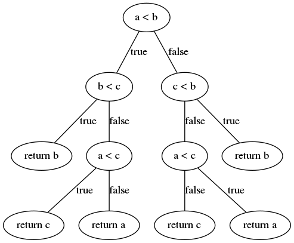
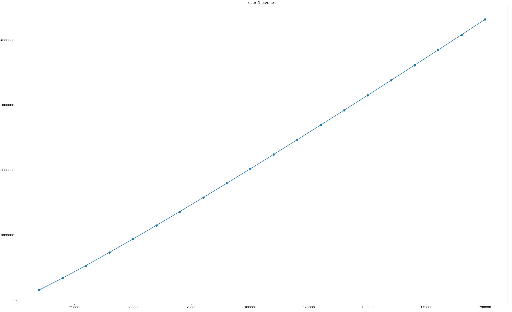
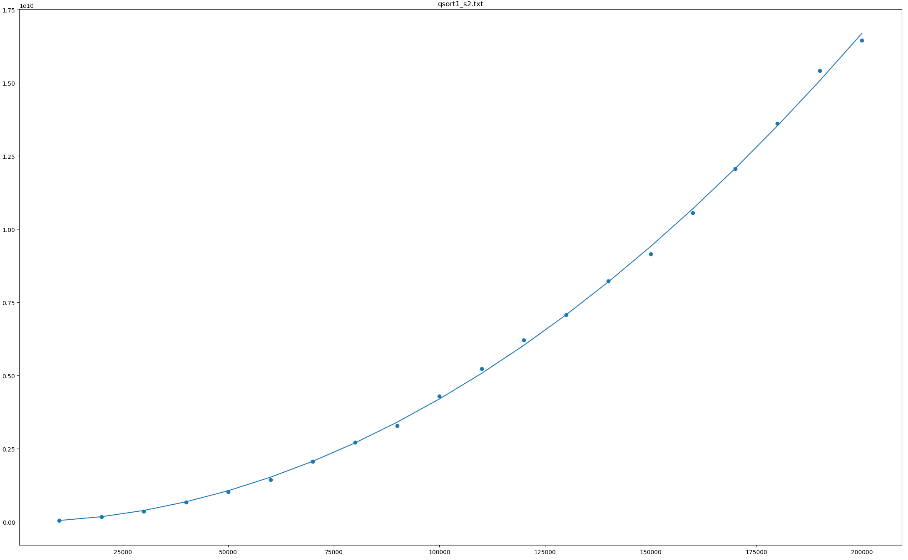
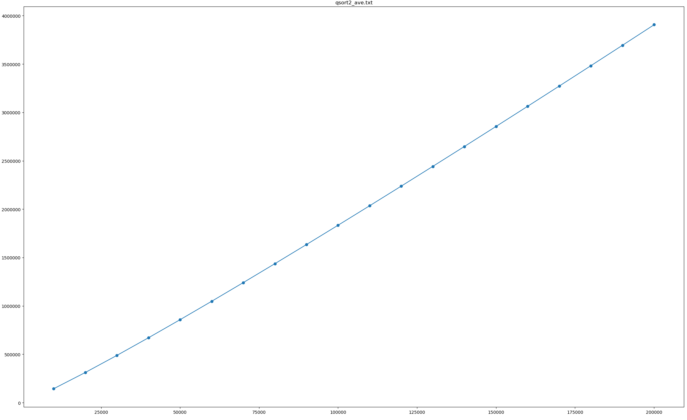
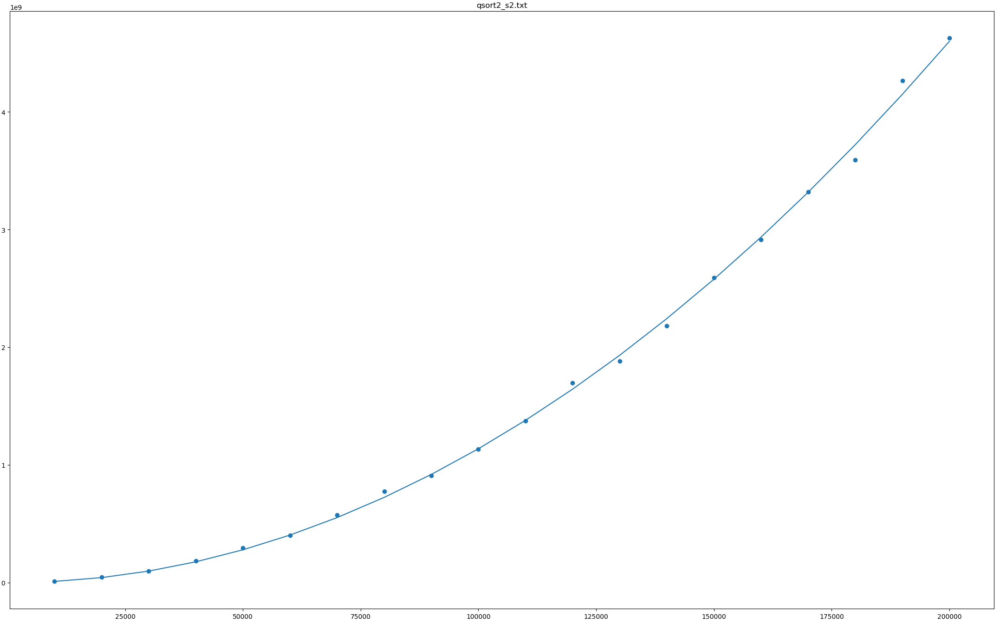

# 随机化快速排序的模拟与分析
## 作者
李晨昊 2017011466

## 摘要
本文通过实验模拟研究了两种快速排序的轴点选取策略(随机取轴点和三元素取中位数选取轴点)的比较次数的期望以及方差。

## 引言
在1961年由Tony Hoare发表的快速排序算法是迄今为止最为常用的排序算法之一，在C++，Java等主流编程语言的标准库中都有该算法的实例。对于通常的算法实现，简单的分析可以得出其最坏情况时间复杂度为$O(n^2)$，而平均意义下时间复杂度为$O(n\log n)$。

通过运用Blum、Floyd、Pratt、Rivest、Tarjan提出的最坏线性时间查找中位数的算法可以保证快速排序在最坏情况下花费$O(n\log n)$时间，但是通常情况下这一算法带来的较大的常数因子使得这种方案并没有被广泛采用，这里也不对其做出分析。

实践中一种有效地规避恶意输入下的算法花费$O(n^2)$时间的办法是随机选取轴点对序列进行分割。通过稍细致的分析可以得出，如果每一次都是从所有可能的元素中独立且均匀地选取轴点，那么所做比较次数的期望为$2n\ln n + O(n)$，方差的推导则很困难。下面将用编程模拟的方法研究比较次数的期望和方差。

朴素的快速排序算法存在很多可以优化的地方，一种常见的(C++的标准库中应用了该方法)优化方式是选择序列中三个元素的中位数作为轴点，下面也将对这种优化比较次数的期望和方差进行分析，以下对此都简称三元素中位数划分法。

## 方法

下面将用C++来实现代码。

在普通的快速排序的基础上只需要记录比较次数即可收集所需数据，这一点可以利用C++的运算符重载，每一次比较的同时都更新计数器即可。
```cpp
int cmp_cnt = 0;

struct Int
{
    int val;
    bool operator<(Int rhs) const
    {
        ++cmp_cnt;
        return val < rhs.val;
    }
};
```

快速排序中最重要的partition操作代码如下，这参考了*Introduction to Algorithms*的实现。它将只利用上面定义的小于号来比较两个数。

```cpp
Int *partition(Int *l, Int *r)
{
    Int x = *r, *i = l;
    for (Int *j = l; j < r; ++j)
        if (*j < x)
            std::swap(*i++, *j);
    std::swap(*i, *r);
    return i;
}
```

在partition基础上衍生出我将要研究的两种划分方式，分别是随机划分和三元素中位数划分。
```cpp
Int *random_partition(Int *l, Int *r)
{
    std::swap(l[dis(mt, decltype(dis)::param_type(0, r - l + 1))], *r);
    return partition(l, r);
}
Int &median(Int &a, Int &b, Int &c)
{
    return a < b ? b < c ? b : a < c ? c : a : c < b ? b : a < c ? a : c;
}
Int *mid_partition(Int *l, Int *r)
{
    std::swap(median(*l, *(l + (r - l) / 2), *r), *r);
    return partition(l, r);
}
```

随机函数没有采用C语言的rand函数，这是公认因为该函数产生的随机数的随机性较差。这里采用了C++标准库中的mt19937随机数发生器，它基于Mersenne twisters算法。这算法是由Makoto Matsumoto和Takuji Nishimura于1997年开发的，基于有限二进制字段上的矩阵线性再生。可以快速产生高质量的伪随机数，伪随机数的周期长达$2^{19937}-1$。

最终，在主函数中多次随机产生序列并且调用快速排序函数进行统计。

除此之外，还有一个程序用于验证我对于三元素中位数划分法的期望比较次数的推导。
```cpp
double dp[N + 1];
dp[1] = 0, dp[2] = 1;
for (int i = 3; i <= N; ++i)
{
    double fac = 6.0 / i / (i - 1) / (i - 2);
    double ans = 0.0;
    for (int j = 1; j <= i - 2; ++j)
        ans += fac * (i - 1 - j) * j * (dp[j] + dp[i - 1 - j]);
    dp[i] = ans + i + 5.0 / 3.0;
}
```
具体的推导见下一节。

## 方法的有效性

### 1. 快速排序的正确性

利用数学归纳法容易证明，partition函数中维持循环不变式(用$p.val$表示指针$p$指向的值)
1. 对于任意$l\le k\lt i$，有$k.val\lt x$
2. 对于任意$i\le k\lt j$，有$k.val\ge x$
3. 对于$k = r$，有$k.val = x$

于是在partition函数返回时，将保证
1. 对于任意$l\le k\lt i$，有$k.val\lt x$
2. 对于任意$i\le k\le r$，有$k.val\ge x$

于是便可分别进入$l, i - 1$和$i + 1, r$两个分支进行递归。对于qsort函数自身，可以建立递归不变式

- qsort函数返回时，区间$[l, r]$已经完成排序
  
这也是容易证明的。


### 2. 对于样本数据的处理

程序中将用
$$\overline{x} = \frac{\sum_{k=i}^n{x_i}}{n}$$
$$s^2 = \frac{\sum_{k=i}^n{(x_i-\overline{x})^2}}{n-1}$$
来分别作为$E(x)$和$Var(x)$的估计值，容易证明这两个估计都是无偏的。

### 3. 三元素中位数划分法的期望比较次数推导

程序中采用了$l,l+(r-l)/2,r$这三个位置的元素取中位数，事实上这三个位置也可以是随机选择的，只要保证互异即可。下面假设序列中元素各不相同，分别记这三个元素在当前序列中分别为第$a_1,a_2,a_3$大，不失一般性，设$a_1\lt a_2\lt a_3$，则它们的中位数即为第$a_2$大数。设当前处理的序列长度为$n(n=r-l+1)$，则$a_1,a_2,a_3$共有$C_n^3$种取值。

下面考查$a_2$的各种取值情况。由乘法法则，在所有的$C_n^3$种取值中，$a_2=k,2\le k\le n-1$共出现$(k-1)(n-k)$次。比中位数小的元素数目为$j=k-1, 1\le j\le n-2$，共出现$j(n-1-j)$次，如果在实际排序中遇到这种情况，就会分别进入长度为$j$和$n-j-1$的两个递归分支，这就是代码中更新变量$ans$的依据。

代码中设置$dp[i]=ans+\frac{5}{3}$，这是因为partition函数本身进行$i-1$次比较。而计算中位数的函数median函数可看成一棵决策树如下



其中的每个叶节点对应一种返回值，枚举$a,b,c$所有6中可能的大小顺序可知进入每个叶节点的概率都是$\frac{1}{6}$。从而找出中位数的期望比较次数为$\frac{1}{6}(2+2+3+3+3+3)=\frac{8}{3}$，再考虑上$i-1$的$-1$得到$\frac{5}{3}$

## 原始数据及初步分析

随机选择轴点法比较次数样本均值，样本方差(样本容量=4000)
| n      | 样本均值     | 样本方差         |
| ------ | ------------ | ---------------- |
| 10000  | 155910.3285  | 42525845.3929    |
| 20000  | 339376.2020  | 169050984.5928   |
| 30000  | 533062.0548  | 365412154.6024   |
| 40000  | 734308.1852  | 666375284.0244   |
| 50000  | 940073.2225  | 1028611766.6542  |
| 60000  | 1148875.4013 | 1434314045.2641  |
| 70000  | 1361734.6655 | 2064089651.9921  |
| 80000  | 1578473.3600 | 2712448082.8131  |
| 90000  | 1797520.3753 | 3280387565.5673  |
| 100000 | 2020402.6765 | 4294765650.8230  |
| 110000 | 2240341.0723 | 5223985415.8975  |
| 120000 | 2466409.5040 | 6217239711.3928  |
| 130000 | 2690546.8245 | 7079737204.8244  |
| 140000 | 2917924.4660 | 8229308315.2081  |
| 150000 | 3147550.3862 | 9145019426.4342  |
| 160000 | 3379004.8245 | 10557304032.0377 |
| 170000 | 3609516.8440 | 12057089707.3030 |
| 180000 | 3846230.9627 | 13605079233.3492 |
| 190000 | 4078438.7245 | 15409004827.4239 |
| 200000 | 4316474.6585 | 16447055807.4107 |

三元素中位数划分法比较次数样本均值，样本方差(样本容量=4000)
| n      | 样本均值     | 样本方差        |
| ------ | ------------ | --------------- |
| 10000  | 143929.2373  | 11290626.9867   |
| 20000  | 311559.1487  | 46600319.6315   |
| 30000  | 488089.3422  | 97637548.6053   |
| 40000  | 670775.8098  | 184419212.4267  |
| 50000  | 857218.4030  | 293920606.9478  |
| 60000  | 1047163.3900 | 401693634.3835  |
| 70000  | 1240406.2373 | 575050016.6751  |
| 80000  | 1436479.1060 | 774962730.8175  |
| 90000  | 1633885.1058 | 908395553.4279  |
| 100000 | 1833642.2797 | 1132259669.0427 |
| 110000 | 2035176.6823 | 1374853266.3584 |
| 120000 | 2238316.7255 | 1694485675.0634 |
| 130000 | 2441388.3365 | 1882190879.4851 |
| 140000 | 2647771.0075 | 2179907240.0435 |
| 150000 | 2856055.2015 | 2590635849.9334 |
| 160000 | 3062874.3462 | 2915447027.3802 |
| 170000 | 3271271.3457 | 3320483775.7876 |
| 180000 | 3482580.3860 | 3590601359.1778 |
| 190000 | 3692463.4060 | 4265546601.2745 |
| 200000 | 3906875.0220 | 4625816529.2438 |


三元素中位数划分法比较次数估算
| n      | 比较次数     |
| ------ | ------------ |
| 10000  | 143925.4196  |
| 20000  | 311600.7779  |
| 30000  | 488245.6113  |
| 40000  | 670715.3525  |
| 50000  | 857516.4953  |
| 60000  | 1047769.3704 |
| 70000  | 1240892.7167 |
| 80000  | 1436473.4059 |
| 90000  | 1634202.5408 |
| 100000 | 1833840.3550 |
| 110000 | 2035195.3064 |
| 120000 | 2238110.8388 |
| 130000 | 2442456.5888 |
| 140000 | 2648122.3135 |
| 150000 | 2855013.5625 |
| 160000 | 3063048.5091 |
| 170000 | 3272155.5763 |
| 180000 | 3482271.6232 |
| 190000 | 3693340.5363 |
| 200000 | 3905312.1172 |

很容易看出比较次数(样本均值/估算)大致呈现$O(n\log n)$的增长趋势，而比较次数的样本方差大致呈现$O(n^2)$的增长趋势。后面更精细的数据处理中会用到这个直观的模型。

同时很容易看出，三元素中位数划分法的比较次数具有明显的优势，可以说这个优化的实际效果是相当不错了。

## 数据处理
用如下python程序来处理数据
```py
import numpy as np
import matplotlib.pyplot as plt
from scipy import optimize
import sys

x = []
y = []
with open(sys.argv[1], 'r') as f:
    for line in f.readlines():
        a, b = map(float, line.split())
        x.append(a)
        y.append(b)
x = np.array(x)
y = np.array(y)

def R2(x, y, y_hat):
    y_bar = np.mean(y)
    SSE = np.sum((y_hat - y) ** 2)
    SST = np.sum((y - y_bar) ** 2)
    return 1 - SSE / SST

def f_nlogn(x, a, b):
    return a * np.log(x) * x + b * x

def f_n2(x, a, b):
    return a * x * x + b * x

f = f_nlogn if sys.argv[2] == 'nlogn' else f_n2

param, _ = optimize.curve_fit(f, x, y)
print(param)
print(R2(x, y, f(x, *param)))
plt.title(sys.argv[1])
plt.scatter(x, y)
plt.plot(x, f(x, *param))
plt.show()
```
按照之前预计的模型，分别执行
```
python fit.py qsort1_ave.txt nlogn
python fit.py qsort1_s2.txt n2
python fit.py qsort2_ave.txt nlogn
python fit.py qsort2_s2.txt n2
python fit.py qsort2_calc.txt nlogn
```
得到的结果是
$$E_1(x)=2.00654308n\ln n - 2.92169522n; R^2=0.9999991$$
$$Var_1(x)=0.414417426n^2 + 554.486067n; R^2=0.9993299$$
$$E_2(x)=1.71911024n\ln n - 1.45591435n; R^2=0.9999997$$
$$Var_2(x)=0.116299490n^2 - 263.095651n; R^2=0.9989134$$
$$E_{2,calc}(x)=1.71408894n\ln n - 1.39575068n; R^2=0.9^{11}19713$$

从结果的图形上来看，这一模型能比较好的拟合比较次数的均值和方差。






## 结论
实验结果基本上验证了随机选择轴点的快速排序算法的平均比较次数为$2n\ln n + O(n)$，同时还给出了其方差的分析，基本可以确认方差与$n$呈现平方关系。

同时实验和理论推导都确认了三元素中位数划分法是一个很不错的优化方法，实现容易，且能够有效规避原始的快速排序最常见的最坏情形：输入序列已经按升序或降序排列好。虽然这个方法最坏情况下也仍然要做$O(n^2)$次比较，但是如果把它和随机取轴点法结合起来，即随机取某三个元素的中位数，那么将会成为一种实用性非常强的方法。

## 不足
缺少对总体方差表达式的理论推导，基本上只能限于对结果的分析处理，这样一来拟合模型的设计存在随意性，可能效果不够好。

此外在实验过程中，我发现样本容量不够大时，样本方差的波动会非常剧烈，因此我采用了4000这么大的样本容量。如果有更好的估计总体方差的办法也许就可以避免这一点。